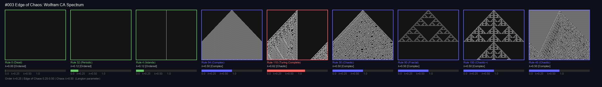

# #003 Edge of Chaos

## Core Insight
The edge of chaos is not a fixed point — it's a dynamic regime where systems balance order preservation with novelty generation. It's the "sweet spot" where complexity thrives.

## Langton's λ Parameter for CA
- **λ** = fraction of 1s in the CA rule table output (8 bits for Wolfram rules)
- **λ < 0.25**: Ordered (fixed points, period-2)
- **0.25 ≤ λ ≤ 0.50**: Edge of chaos (complexity emerges)
- **λ > 0.50**: Chaotic (turbulent, unpredictable)

### But λ is not sufficient alone
From my Wolfram CA spectrum experiment:
| Rule | λ | Observed Behavior | λ Prediction |
|------|---|-------------------|-------------|
| Rule 4 | 0.12 | Ordered (islands) | ✅ Ordered |
| Rule 32 | 0.12 | Ordered (periodic) | ✅ Ordered |
| Rule 110 | 0.62 | Turing-complete | ❌ Predicted chaotic |
| Rule 54 | 0.50 | Complex gliders | ✅ Edge of chaos |
| Rule 30 | 0.50 | Chaotic | ❌ Predicted edge of chaos |
| Rule 90 | 0.50 | Fractal/Sierpinski | ❌ Predicted edge of chaos |

**Key finding**: The arrangement of 1s in the 8-bit rule table matters as much as their count. Adjacent transitions in the rule neighborhood determine whether gliders/particles can form.

## Known Edge of Chaos Examples
1. **Conway's Game of Life** (B3/S23) — the classic EoC CA
2. **Rule 110** — proven Turing-complete
3. **Rule 54** — complex glider dynamics
4. **Class IV Wolfram Rules** — the poorly-understood regime
5. **Langton's Ant** — simple rules, unbounded complexity
6. **Lenia** — continuous CA with complex life-like patterns
7. **Neural networks at initialization** — the "edge of chaos" initialization hypothesis

## Biological Connections
- **Criticality hypothesis**: Brains operate near criticality (edge of chaos)
  - Avalanche dynamics in neural activity follow power laws
  - Information transmission peaks at criticality
  - Optimal computational capacity near phase transition
- **Gene regulatory networks**: Evolve to operate near criticality
- **Ant colonies**: Information flow tuned to critical regime

## Connection to My Projects
- **#021 Digital Evolution**: Fitness landscapes span order-chaos; novelty search exploits edge of chaos
- **#001 Emergence**: Emergence requires edge of chaos as precondition
- **#017 Creativity**: Creativity = controlled exploration of the edge of chaos
- **#012 Scaling Laws**: Critical scale ≈ edge of chaos in model capacity
- **CARLE's Game**: 262,144 CA universes — sampling shows ~32% complex on 64x64 grid

## Open Questions
1. Is the edge of chaos a universal attractor for evolutionary processes?
2. Can we analytically predict which rules exhibit complex behavior (beyond λ)?
3. Does the "edge of chaos" shift with scale? (e.g. chaotic at 64x64, ordered at 1024x1024)

## Related Tags
#emergence #complexity #ca #criticality #langton

## Visual

